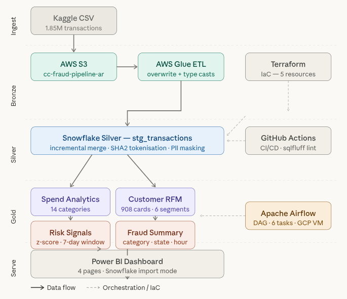
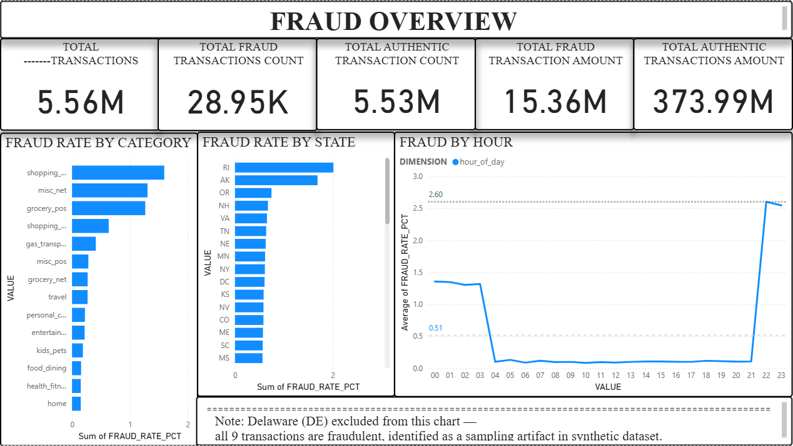
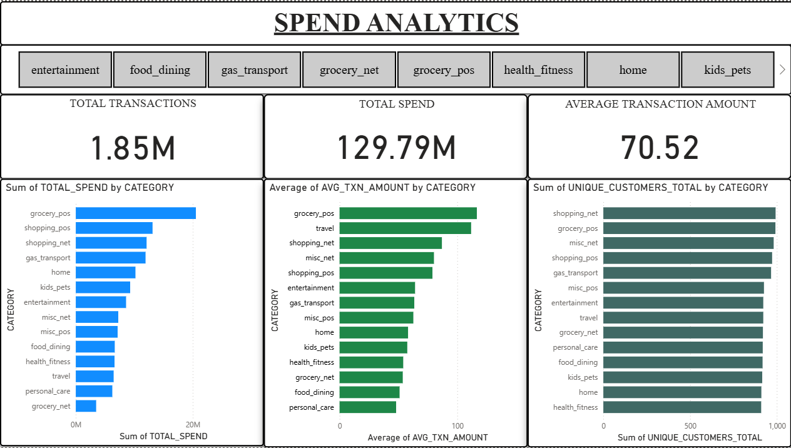
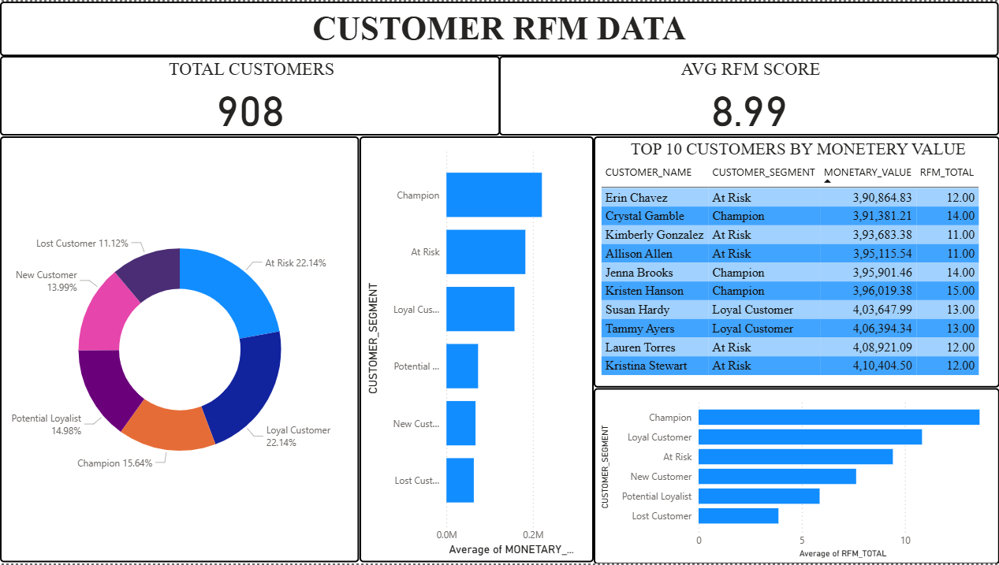
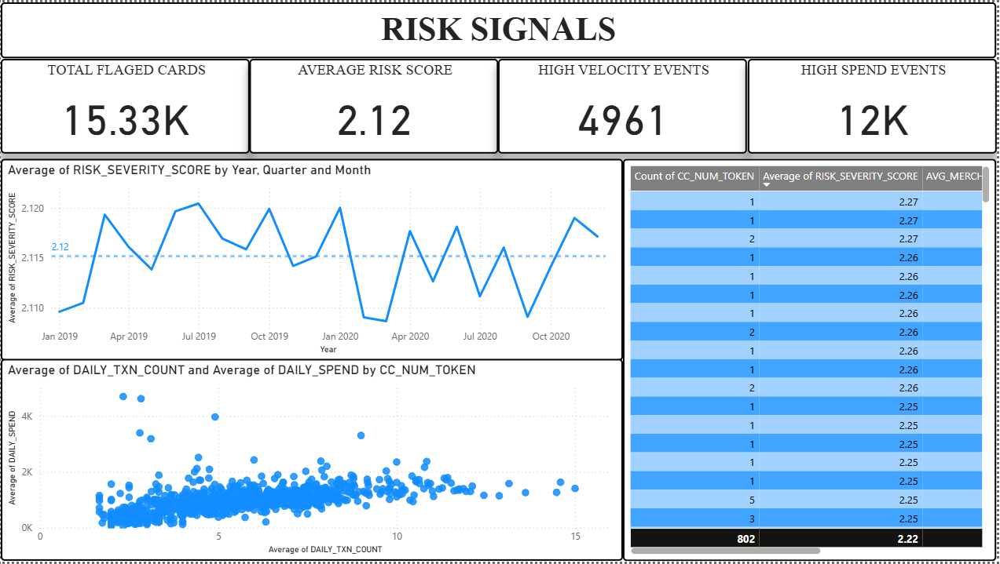

# Credit Card Transaction Risk & Spend Analytics Pipeline

A production-style data engineering project that ingests 1.85M+ credit card transactions, moves them through a Medallion architecture, and serves business-ready analytics to Power BI — with automated testing, CI/CD, orchestration, and infrastructure-as-code throughout.

---

## Why this project exists

I built this pipeline because I want to know how a real pipeline actually looks like. So I gave myself one rule that was that i should use somthing that is used somwhere in the production enviorment as i dont know much about production env i just made the most out of what i got out of checking what does prod env actually use (which was mostly just google search and some yt vids) in this the data lands in object storage (s3), moves through layered transformations, gets tested at every stage, runs on a schedule, and deploys through CI/CD. Nothing is triggered manually
 
The dataset is synthetic credit card transaction data (~1.85M rows) from Kaggle (this was the best one that i could work with) honestly understanding the data itself wasn't the hard part it was everything else around it like making the pipeline safe to re-run, handling schema drift I didn't thought about, masking PII the right way rather than just dropping the column, and building the risk model on actual statistics instead of just multiplying averages by some number that's what I have done 

let me know if there is somthing more i could have done in this 

---

## Stack

```
Kaggle CSV → AWS S3 → AWS Glue → Snowflake → dbt → Apache Airflow → GitHub Actions → Power BI
```

| Layer | Tool |
|---|---|
| Object storage | AWS S3 (ap-southeast-1) singapore |
| ETL | AWS Glue (PySpark) |
| Data warehouse | Snowflake |
| Transformation | dbt 1.11.7 |
| Orchestration | Apache Airflow 2.8.0 (GCP e2-micro) |
| CI/CD | GitHub Actions |
| IaC | Terraform |
| Visualization | Power BI |

---

## Architecture

**Medallion (Bronze → Silver → Gold)**

- **Bronze** — Raw CSVs land in S3 as-is. No transformation, no cleaning. This layer is immutable.
- **Silver** — Glue ETL extracts from S3 and loads into Snowflake (`CC_FRAUD_SILVER.STAGING`). dbt then runs `stg_transactions` — an incremental merge model that handles deduplication, timestamp cleaning, and PII tokenization
- **Gold** — Four analytics marts in `CC_FRAUD_GOLD.MARTS`, each serving a distinct dashboard in power BI 



---

## Gold Layer: What got built and why

**`mart_spend_analytics`** — Spend aggregated by transaction category (14 categories). Uses `cc_num_token` for customer counts rather than raw card numbers — prevents overcounting if the same card appears in both CSV files.

**`mart_customer_rfm`** — RFM segmentation across 908 unique cardholders with legitimate transactions. Segments range from Champion to Lost Customer. Recency uses `DATEDIFF` from the dataset's end date (2020-12-31) rather than today's date — the dataset is historical, so a fixed anchor makes the scores reproducible.

**`mart_risk_signals`** — The most technically involved mart. Flags card-days where transaction count or spend deviated significantly from that card's rolling 7-day baseline. The anomaly threshold is a z-score of 2.0 — validated against the actual distribution of the dataset (max z-score observed: 2.27). Rolling windows use `RANGE INTERVAL` rather than `ROWS` to handle sparse transaction days correctly.

**`mart_fraud_summary`** — Fraud rates sliced across three dimensions: category, state, and hour of day. Uses a UNION approach to keep the output to one table (89 rows) rather than separate tables per dimension. One known quirk: Delaware shows 100% fraud rate — this is a sampling artifact of the synthetic dataset and is documented in the Power BI dashboard.

---

## Key engineering decisions

**Idempotency in Glue ETL**
The Glue job runs on a schedule via Airflow. Using `write mode = append` would duplicate all 1.85M rows on every run. The job uses `overwrite` mode, which makes it safe to re-run. `CC_NUM` and `ZIP` are explicitly cast to `StringType` before writing — Glue's type inference inconsistently maps these to numeric types, which breaks downstream joins.

**Incremental merge in dbt**
`stg_transactions` uses `incremental_strategy=merge` with `trans_num` as the unique key. The incremental filter uses `COALESCE(MAX(load_timestamp), '1900-01-01')` — the `COALESCE` matters because `MAX()` on an empty table returns `NULL`, which would cause the first run to load nothing.

**PII handling**
Card numbers are SHA2-256 tokenized in the Silver layer (`cc_num_token`). All Gold marts use the token — never the raw card number. A Snowflake Dynamic Data Masking policy on `CC_NUM` means the raw value is only visible to privileged roles, and the token is consistent enough to use as a join key across marts.

**Schema prefix fix**
dbt's default schema naming logic produces names like `STAGING_STAGING` when the profile schema and model schema have the same name. A custom `generate_schema_name` macro overrides this behavior so models land exactly where they should.

---

## Testing

23 automated tests across all layers, run in CI on every push to main

| Model | Tests |
|---|---|
| `stg_transactions` | 7 |
| `mart_spend_analytics` | 3 |
| `mart_customer_rfm` | 4 |
| `mart_risk_signals` | 6 |
| `mart_fraud_summary` | 4 |

Tests cover: uniqueness, not-null, accepted values, and referential integrity. In the Airflow DAG, staging tests run before the mart models are built — a test failure blocks downstream execution rather than propagating bad data silently

---

## CI/CD

Two jobs run on every push to `main` -- 

1. **dbt-test** — installs dbt, runs `dbt deps`, `dbt compile`, and all 23 tests against Snowflake using GitHub Secrets for credentials.
2. **sqlfluff-lint** — lints all SQL models against the Snowflake dialect using a custom `.sqlfluff` config with project-specific exclusions.

Snowflake credentials are stored as GitHub Secrets and injected into a CI-specific `profiles.yml` via environment variables.

---

## Infrastructure

Snowflake resources are provisioned via Terraform (5 resources under management):
- Warehouse: `CC_FRAUD_WH` (X-SMALL, auto-suspend 60s, auto-resume)
- Databases: `CC_FRAUD_SILVER`, `CC_FRAUD_GOLD`
- Schemas: `STAGING`, `MARTS`
- Role: `DBT_ROLE` with scoped permissions
- Resource monitor: alerts at 80% credit usage, suspends at 100%

---

## Orchestration

Apache Airflow 2.8.0 runs on a GCP e2-micro VM. The DAG runs daily and chains 6 tasks:

```
trigger_glue_etl → run_dbt_staging → test_dbt_staging
                                   → run_dbt_marts → test_dbt_marts → generate_dbt_docs
```

Quality gates are built into the chain — `test_dbt_staging` must pass before marts run.

---

## Dashboard

4-page Power BI dashboard connected to Snowflake in Import mode:

- **Fraud Overview** — fraud rates by category, state, and hour of day
- **Spend Analytics** — total spend, avg transaction amount, unique customers by category
- **Customer RFM** — segment distribution, monetary value, top customers
- **Risk Signals** — flagged cards over time, spend vs. velocity scatter, top risk scores

---

### Screenshots





## Project structure

```
cc_fraud_pipeline/
├── .github/workflows/dbt_ci.yml       # GitHub Actions CI/CD
├── terraform/main.tf                  # Snowflake infrastructure
├── glue-scripts/etl.py                # Glue ETL job
└── dbt/cc_fraud_dbt/
    ├── macros/generate_schema_name.sql
    ├── models/
    │   ├── staging/
    │   │   ├── stg_transactions.sql
    │   │   └── schema.yml
    │   └── marts/
    │       ├── mart_spend_analytics.sql
    │       ├── mart_customer_rfm.sql
    │       ├── mart_risk_signals.sql
    │       ├── mart_fraud_summary.sql
    │       └── schema.yml
    ├── dbt_project.yml
    └── packages.yml
```

---

## Setup (high-level)

This project uses real cloud infrastructure — there's no local-only version. To replicate it you'd need:

- AWS account (S3 bucket, Glue job, IAM role, Secrets Manager)
- Snowflake account (free trial works)
- dbt installed locally (`pip install dbt-snowflake==1.11.3`)
- GitHub Secrets configured for CI: `SNOWFLAKE_ACCOUNT`, `SNOWFLAKE_USER`, `SNOWFLAKE_PASSWORD`
- GCP VM for Airflow (e2-micro is sufficient)

The Terraform config in `/terraform/main.tf` handles Snowflake resource provisioning. The Glue script and dbt profiles use environment variables for credentials — no secrets are hardcoded anywhere in the repo.

---
